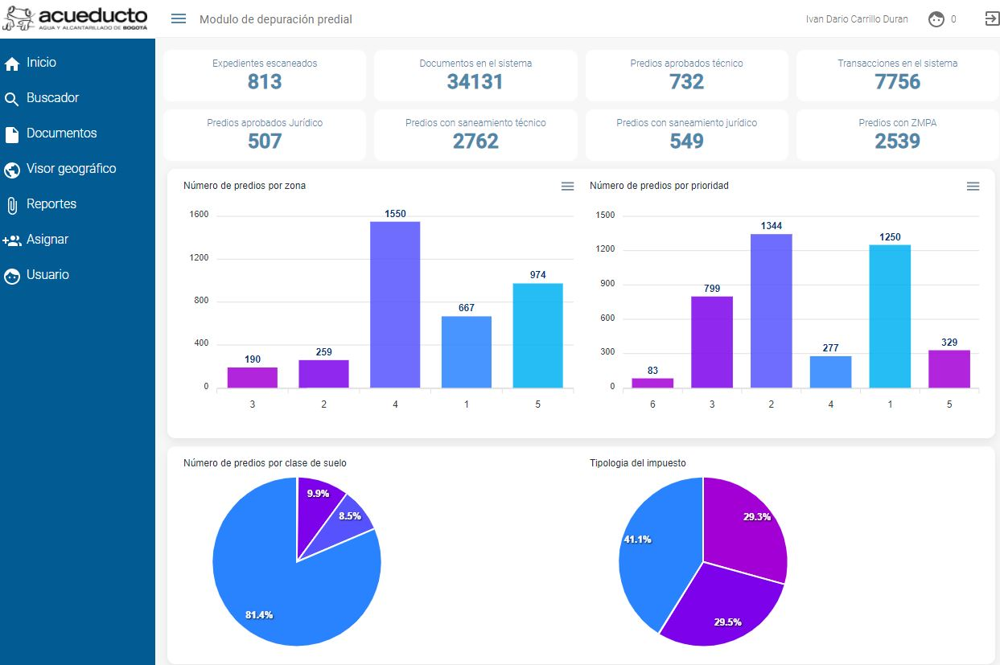

# Acueducto Bienes Raices

Aplicativo de cargue de información predial para la dirección de bienes raices del acueducto de Bogotá




## Installation


1. Install dependences

```bash
npm run i
```

2. Local deploy

first run the start local deploy for modify the web app which is deployed on port 9000
```bash
npm run start

```

then run the backend which is deployed on port 3000

```bash
npm run nodemon

```


## Usage

run the command for build front-end

```bash
npm run build

```

run the command for build back-end

```bash
npm run build_backend

```

to create the project build in [pip](dist) folder

## docker

To deploy in docker run the next command.

```bash
docker-compose up -d --build

```

More info, in  Dockerfile and docker-compose.yml

## Database

This project uses PostgreSQL in docker container, please visit:

[kartoza/postgis](https://hub.docker.com/r/kartoza/postgis/)

and follow the guide for install in docker.

## Contributing


EAAB-COLOMBIA

## License
Private Project
